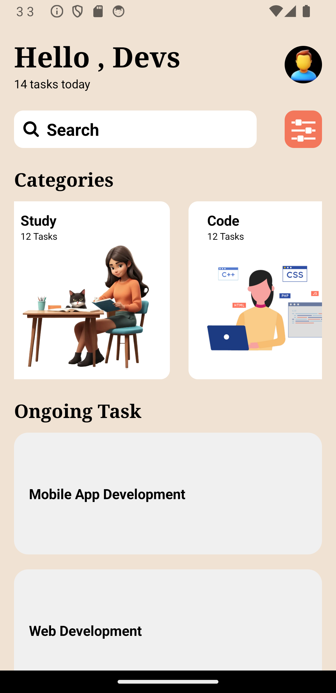

# React Native UI Design App

This app showcases various UI components and features built using React Native.

## Components

### 1. ScrollView Component

The ScrollView component provides a scrolling view for the app content, allowing users to scroll through the content if it exceeds the screen size. 

Usage:
```jsx
<ScrollView>
  {/* Content goes here */}
</ScrollView>
```

### 2. View Component
The View component is a fundamental building block for creating UI layouts in React Native. It's used to group and style other components.

Usage:
```jsx
<View style={styles.container}>
  {/* Content goes here */}
</View>
```

### 3. FlatList Component
The FlatList component is used for efficiently rendering lists of data. It only renders the items currently visible on the screen, improving performance for large lists.

Usage:
```jsx
<FlatList
  data={data}
  renderItem={renderItem}
  keyExtractor={(item) => item.id}
/>
```

### 4. Image Component
The Image component is used to display images in the app. It supports various sources, including local files, network URLs, and base64 encoded images.

Usage:
```jsx
<Image
  source={require('./path/to/image.png')}
  style={styles.image}
/>
```

### 5. Stylesheet
The Stylesheet module is used to define styles for components in a React Native app. It provides a way to organize and apply styles efficiently.

Usage:
```jsx
const styles = StyleSheet.create({
  container: {
    flex: 1,
    backgroundColor: '#fff',
    alignItems: 'center',
    justifyContent: 'center',
  },
```

### 6. TextInput Component
The TextInput component allows users to input text. It can be styled and configured to handle various text input requirements.

Usage:
```jsx
<TextInput
  style={styles.input}
  placeholder="Enter text"
  onChangeText={(text) => console.log(text)}
/>
```

### 7. Button Component
The Button component is used to create a clickable button in the app. It can be customized with a title and onPress event handler.

Usage:
```jsx
<Button
  title="Press me"
  onPress={() => console.log('Button pressed')}
/>
```

### 8. Text Component
The Text component is used to display text in the app. It supports styling and formatting options.

Usage:
```jsx
<Text style={styles.text}>Hello, world!</Text>
```

## Screenshot
